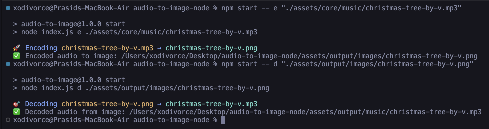

# Audio To Image Encryption

### 👀 Here’s a look


#### A simple tool that encodes audio files into PNG images and decodes them back seamlessly, without any quality loss.

[](https://github.com/xodivorce/audio-to-image-node/)
[](https://github.com/xodivorce/audio-to-image-node/)
[](https://github.com/xodivorce/audio-to-image-node/)

> **🥰 Like this project? Please consider giving it a Star (🌟) on GitHub to show us your appreciation. Thank you!**

### ⚡️ Technologies used
Here’s what fuels this site:


### 🛠️ Installation:
Want to get started quickly? Follow the instructions below to install and run the project on your system.

1. **Clone the repository**
   - Clone the repository to your local machine:
     ```bash
     git clone git@github.com:xodivorce/audio-to-image-node.git
     ```

2. **Set up your environment**
   - Ensure you have [Node.js](https://nodejs.org/) version 14 or higher installed.

3. **Install dependencies**
   - Navigate to the project directory and install the required packages:
     ```bash
     npm install
     ```

4. **Start the tool**
   - Start the application locally:
     ```bash
     node index.js
     # For quick testing, use the command `npm start`.
     ```

🐞 **Got Ideas or Spotted a Bug?**  
Don’t be shy! [*Open an issue*](https://github.com/xodivorce/audio-to-image-node/issues) to discuss new features, enhancements, or any bugs you find. Your feedback is golden!!
- Let’s create something epic together! ✨

### 📄 License 

This project is licensed under the [**MIT License**](LICENSE.txt).  
You are free to use, modify, and distribute this code for personal or commercial purposes, as long as you include the original copyright and license notice in any copies or substantial portions of the software.

<br></br>

****

An open-source project - crafted with ❤️ by **xodivorce**